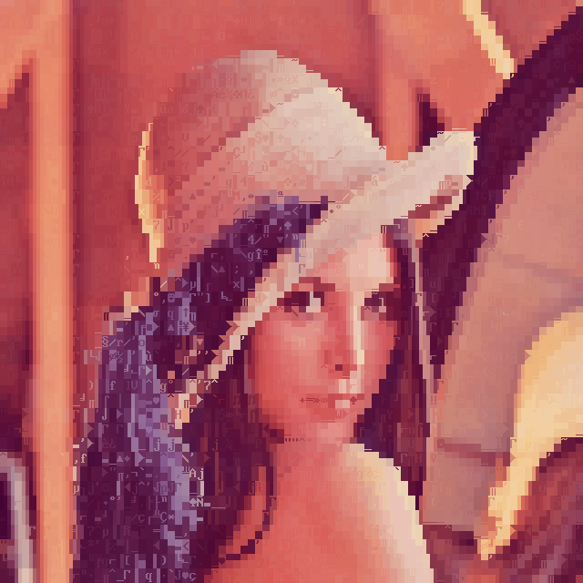

```
Converts Images to ANSi Files

Usage: gif2ans [OPTIONS] <INPUT> <OUTPUT>

Arguments:
  <INPUT>   
  <OUTPUT>  

Options:
      --vga50                 Use 8x8 font
      --columns <1 to 65535>  Number of columns [default: 80]
      --restrict              Restrict character set to shading, half blocks, vertical blocks and full block
      --image                 Generates an PNG image file
      --truecolor             Use 24-bit color
  -h, --help                  Print help
  -V, --version               Print version
```


